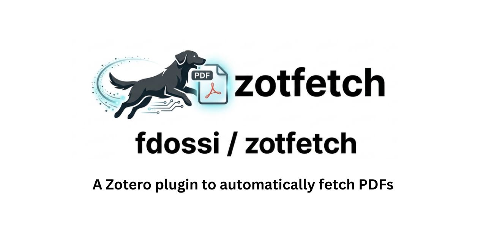

# ZotFetch: Batch PDF Downloader for Zotero



[](https://doi.org/10.5281/zenodo.19149482)

**Author:** Fabio Dossi &nbsp;|&nbsp; **Version:** 1.4.0 &nbsp;|&nbsp; [📖 User Manual (Wiki)](https://github.com/fdossi/zotfetch/wiki)

**ZotFetch** is a [Zotero 8](https://www.zotero.org/) plugin that automatically downloads PDFs for multiple library items in a single operation. It uses a modular two-stage pipeline — **source resolution** then **PDF extraction** — so that landing pages from publishers, proxies, and repositories are correctly resolved to their actual PDF URL before import.

---

## Features

- **Two-stage pipeline**: SourceResolver → PDFResolver → AttachmentImporter. Landing pages are never accidentally imported as PDFs.
- **Multi-source download**: Native OA → Unpaywall → Semantic Scholar → OpenAlex → OA Repository → DOI Landing → Institutional Proxy → CAPES
- **HTML-to-PDF extraction**: Publisher landing pages (Springer, Nature, Wiley, Taylor & Francis, ACS, IEEE, MDPI, Frontiers, Elsevier/ScienceDirect, SciELO.br) are parsed with a DOM resolver or a generic HTML extractor (citation_pdf_url meta, `<link rel="alternate">`, `<iframe>`, `<embed>`, and PDF anchors)
- **Fast Mode**: Two-pass strategy — lightweight open-access sources first, institutional fallbacks only for unresolved items
- **Ultra Fast Mode**: Single-pass, maximum speed, prioritises open-access sources
- **Adaptive rate limiting**: Per-domain request spacing with exponential backoff on failures
- **Anti-captcha protection**: Tracks consecutive captcha hits per domain; blocks domain after 3 hits, resets on success
- **DOI lookup**: Automatically resolves missing DOIs via CrossRef before attempting downloads
- **Retry Failed Items / Retry After Auth**: Targeted retry flows for failed or auth-blocked items
- **Live progress**: Color-coded status (🔵/🟢/🟡/🔴) with `PDFs X/Y (Z%)` counter
- **Institutional proxy**: Configurable EZproxy/Shibboleth URL for legal paywalled access; Semantic Scholar links are also routed through the proxy when applicable
- **Extensible**: New SourceResolvers and PDFResolvers can be added without touching the orchestration code

---

## Installation

### From a release XPI

1. Download `zotfetch-X.Y.Z.xpi` from the [Releases](https://github.com/fdossi/zotfetch/releases) page
2. In Zotero, go to **Tools → Add-ons**
3. Click the gear icon (⚙️) → **Install Add-on From File…**
4. Select the downloaded `.xpi` file
5. Restart Zotero when prompted

### From source

Requirements: Python 3.8+

```bash
git clone https://github.com/fdossi/zotfetch.git
cd autoPDFdownloader
python build.py --clean
```

This creates `zotfetch-1.4.0.xpi`. Install it via the steps above.

---

## Usage

Select one or more items in your Zotero library, then right-click and hover over **ZotFetch ▶** to open the submenu:

| Command | Description |
|---|---|
| **Batch Download** | Downloads PDFs for all selected items using all sources (two-pass if Fast Mode is on) |
| **Ultra Fast** | Single-pass, fastest mode — open-access sources only. May download fewer PDFs than Batch Download. |
| **Retry Failed** | Re-attempts only items that failed in the most recent batch |
| **Retry After Auth** | Opens up to 3 DOI URLs in your browser for manual login/captcha, then retries blocked items |
| **Preferences** | Opens the graphical Preferences dialog |

---

## Download Sources

ZotFetch tries sources in this order of priority:

| Priority | Source | Notes |
|---|---|---|
| 110 | **Native OA** | Zotero's built-in open-access finder |
| 100 | **Unpaywall** | Free legal OA PDF lookup (requires email) |
| 95 | **Semantic Scholar** | Graph API open-access PDF field |
| 90 | **OpenAlex** | best_oa_location PDF URL |
| 85 | **OA Repository** | Item URL when host is in the safe OA list |
| 80 | **DOI Landing** | Publisher page via doi.org (HTML→PDF extraction) |
| 75 | **Institutional Proxy** | DOI routed through your proxy; also routes S2 PDF links |
| 70 | **CAPES** | Brazilian CAPES portal or custom DOI proxy URL |

In **Fast Mode**, sources 110–75 run in Pass 1; unresolved items proceed to Pass 2 (CAPES and institutional fallbacks). In **Ultra Fast Mode**, all sources run in a single pass.

> **Note:** Additional fallback sources can be enabled in `about:config`. See the Configuration section for available options.

### HTML-to-PDF extraction (landing pages)

When a source returns a landing page URL (not a direct PDF), ZotFetch tries to find the real PDF link in this order:

1. **Publisher-specific rule** (Springer, Nature, Wiley, Taylor & Francis, ACS, IEEE, MDPI, Frontiers, Elsevier/ScienceDirect, SciELO.br)
2. **Generic HTML extractor**: `<meta name="citation_pdf_url">`, `<link rel="alternate" type="application/pdf">`, `<iframe>` / `<embed>` / `<object>` with PDF src, `<a>` links to `.pdf` or with "Download PDF" text
3. **Direct validation**: HEAD request to confirm Content-Type: application/pdf before importing

---

## Configuration

Open the graphical settings dialog via **right-click → ZotFetch ▶ → Preferences**. It covers all options grouped into sections — no need to use `about:config`.

Click **? Help** in the dialog to open the [User Manual](https://github.com/fdossi/zotfetch/wiki) with detailed setup instructions for institutional proxy and CAPES.

All preferences are also editable directly in **`about:config`** (Zotero's advanced config editor, **Edit → Settings → Advanced → Config Editor**), filtering by `extensions.zotfetch`.

| Preference key | Default | Description |
|---|---|---|
| `extensions.zotfetch.unpaywallEmail` | _(empty)_ | Your email for Unpaywall/OpenAlex/CrossRef API access. **Required** for most sources. |
| `extensions.zotfetch.institutionalProxyUrl` | _(empty)_ | Your institution's proxy URL, e.g. `https://proxy.myuniversity.edu/login?url=` |
| `extensions.zotfetch.fastMode` | `true` | Enables two-pass Fast Mode |
| `extensions.zotfetch.batchSize` | `30` | Max items to process per batch run |
| `extensions.zotfetch.requestDelayMs` | `900` | Base delay between requests (ms), ±60% jitter applied |
| `extensions.zotfetch.domainGapMs` | `1500` | Minimum gap between requests to the same domain (ms) |
| `extensions.zotfetch.requestTimeoutMs` | `15000` | Per-request HTTP timeout (ms) |
| `extensions.zotfetch.antiCaptchaMode` | `true` | Skip domains that are currently in cooldown |
| `extensions.zotfetch.enableCapesFallback` | `true` | Enable CAPES/DOI proxy as a fallback source |
| `extensions.zotfetch.proxyUrl` | _(empty)_ | CAPES or generic DOI proxy URL |
| `extensions.zotfetch.unpaywallTimeoutMs` | `12000` | Timeout for Unpaywall API requests (ms) |
| `extensions.zotfetch.crossrefTimeoutMs` | `10000` | Timeout for CrossRef DOI lookup (ms) |

### Institutional proxy URL formats

ZotFetch supports all common proxy URL patterns:

| Format | Example |
|---|---|
| Template placeholder | `https://proxy.myuniv.edu/login?url={url}` |
| Direct query parameter | `https://proxy.myuniv.edu/?url=` |
| Query string | `https://proxy.myuniv.edu/proxy?url=` |
| EZproxy bare base | `https://proxy.myuniv.edu` |

---

## Architecture

```
processItem()
├─ IdentifierExtractor.fromItem()          (identifiers.mjs)
│    extracts DOI, arXiv ID, PMID, URL, title, year, firstAuthor
├─ SourceResolver[].buildCandidates()      (source-resolvers.mjs)
│    returns SourceCandidate[] sorted by priority
└─ for each candidate:
     PDFResolver[].resolve()               (pdf-resolvers.mjs)
     ├─ DirectPDFResolver                  HEAD/GET, confirm Content-Type: application/pdf
     ├─ PublisherPatternResolver           publisher-specific DOM rules
     └─ HtmlLandingPDFResolver             generic meta/link/iframe/anchor extraction
     AttachmentImporter.importResolvedPdf() (importer.mjs)
```

### Adding a new source

1. Create a class in `source-resolvers.mjs` that implements:
   - `id` — unique string identifier
   - `enabled()` — returns `boolean`
   - `buildCandidates(item, ids)` — returns `Promise<SourceCandidate[]>`
2. Add it to `_buildSourceResolvers()` in `fetch.mjs` at the appropriate priority position.

### Adding a new PDF extractor

1. Create a class in `pdf-resolvers.mjs` that implements:
   - `canResolve(candidate)` — returns `boolean`
   - `resolve(candidate, ctx)` — returns `Promise<PDFResolutionResult>`
2. Add it to `_buildPdfResolvers()` in `fetch.mjs`.

---

## How Anti-Captcha and Rate Limiting Work

ZotFetch tracks request history per domain:

- **Domain gap**: Waits at least `domainGapMs` milliseconds between requests to the same domain
- **Adaptive backoff**: Exponential extra wait on consecutive non-captcha failures (+1 s, +2 s, +4 s… capped at +15 s). Resets on any success.
- **Captcha threshold**: After 3 consecutive captcha responses from the same domain, that domain is blocked for 30 minutes
- **Failure classification**: `cloudflare` → `captcha` → `auth` → `blocked` → `timeout` → `nopdf` → `network`

---

## Requirements

- **Zotero 8.0.4** or later (not compatible with Zotero 7 or earlier)
- A registered email address for [Unpaywall](https://unpaywall.org/) (free, no sign-up required — just a valid email in the preferences)

---

## Known Limitations

- **Captcha-blocked sessions**: When a publisher serves a captcha, use **ZotFetch ▶ Retry After Auth** to open the URL in your browser, solve the captcha, then retry.
- **JavaScript-rendered publisher pages**: Some publishers (e.g. ScienceDirect app) require JS to load the PDF link. The plugin uses a JS extraction heuristic from inline script blocks as a best effort, but may miss some.
- **Paywalled content without proxy**: Without an institutional proxy configured, ZotFetch can only retrieve freely available (OA) versions of paywalled articles.

---

## License

Released under the [GNU General Public License v3.0](LICENSE).

Contributions via pull requests are welcome.

---

## Disclaimer

THIS SOFTWARE IS PROVIDED "AS IS", WITHOUT WARRANTY OF ANY KIND, EXPRESS OR IMPLIED, INCLUDING BUT NOT LIMITED TO THE WARRANTIES OF MERCHANTABILITY, FITNESS FOR A PARTICULAR PURPOSE, AND NON-INFRINGEMENT. IN NO EVENT SHALL THE AUTHOR OR COPYRIGHT HOLDERS BE LIABLE FOR ANY CLAIM, DAMAGES, OR OTHER LIABILITY — WHETHER IN AN ACTION OF CONTRACT, TORT, OR OTHERWISE — ARISING FROM, OUT OF, OR IN CONNECTION WITH THE SOFTWARE OR THE USE OR OTHER DEALINGS IN THE SOFTWARE.

**The user assumes all risks and sole responsibility for any consequences arising from the use of this plugin.** This includes, but is not limited to, any legal, institutional, or technical consequences related to the access, download, or storage of copyrighted materials. The author makes no representations regarding the legality of any particular use of this plugin in any given jurisdiction. It is the user's responsibility to ensure compliance with all applicable laws, institutional policies, and the terms of service of any platform or content provider accessed through this plugin.

---

## Changelog

### v1.4.0 — Graphical preferences, captcha protection, UA refresh
- **New**: Graphical **Preferences dialog** (`Tools → ZotFetch → Preferences` or right-click submenu). All settings configurable in a clean UI — no `about:config` required.
- **New**: **? Help** button in the Preferences dialog opens the [User Manual wiki](https://github.com/fdossi/zotfetch/wiki).
- **New**: Cross-item domain cooldown — the first captcha from a publisher during a batch blocks all subsequent items from hitting that same publisher in the same run.
- **New**: `NativeSourceResolver` and `NativeDoiSourceResolver` now skip known bot-detection publishers (Elsevier, Wiley, Springer, ACS) entirely — preventing Zotero's native UA from triggering captcha floods.
- **New**: `native-doi` sentinel now checks `negativeCache` and `_localHostAborts` before firing, preventing redundant requests.
- **Fix**: `ScihubPDFResolver` now correctly returns `failureReason: "cloudflare"` (was `"captcha"`) so the priority tracker uses the correct severity.
- **Fix**: `OaRepositorySourceResolver` tests corrected to use `itemUrl` identifier key.
- **Updated**: Browser User-Agent strings refreshed — Chrome 132→135, Edge 132→135, Firefox 135→136, Safari 17→18.
- **Author**: Updated author from "Fabio" to "Fabio Dossi".

### v1.3.0 (2026-04-05) — Pipeline refactoring
- **Breaking internal change**: Discovery and import are now decoupled. `fetchPDF()` is a thin compatibility wrapper; the real work is done by `SourceResolver → PDFResolver → AttachmentImporter`.
- New modules: `identifiers.mjs`, `source-resolvers.mjs`, `pdf-resolvers.mjs`, `importer.mjs`
- New `IdentifierExtractor` scans DOI field, URL field, Extra field, archiveID, and DOI-in-URL patterns
- New `HtmlLandingPDFResolver` correctly extracts PDF links from publisher landing pages using `responseType: "document"` + DOM parsing. Strategies: `citation_pdf_url` meta, `<link rel="alternate">`, `<iframe>`/`<embed>`, and PDF anchors
- New `PublisherPatternResolver` with host-specific DOM rules for: Springer, Nature, Wiley, Taylor & Francis, ACS, IEEE, MDPI, Frontiers, Elsevier/ScienceDirect, SciELO.br
- `InstitutionalProxySourceResolver` now also routes Semantic Scholar PDF URLs through the proxy
- New `DoiLandingSourceResolver` for explicit DOI landing page resolution
- `requestTimeoutMs` preference added (`extensions.zotfetch.requestTimeoutMs`, default 15 000 ms)
- All failure reasons now logged with structured context (source, host, method, elapsed ms)
- `tests/pipeline.test.mjs` added covering 20+ scenarios

### v1.2.0 (2026-03-21)
- All menu items consolidated under a single **ZotFetch ▶** submenu
- Separators added between download actions, retry actions, and preferences

### v1.1.0 (2026-03-19)
- Added institutional proxy support with 4 URL pattern formats
- Fast Mode and Ultra Fast Mode with two-pass download strategy
- Live color-coded progress display
- Retry Failed Items and Retry After Auth commands
- Failure classification pipeline
- Per-domain adaptive backoff
- DOI lookup via CrossRef

### v1.0.0
- Initial release: Native OA, Unpaywall, CAPES fallback
